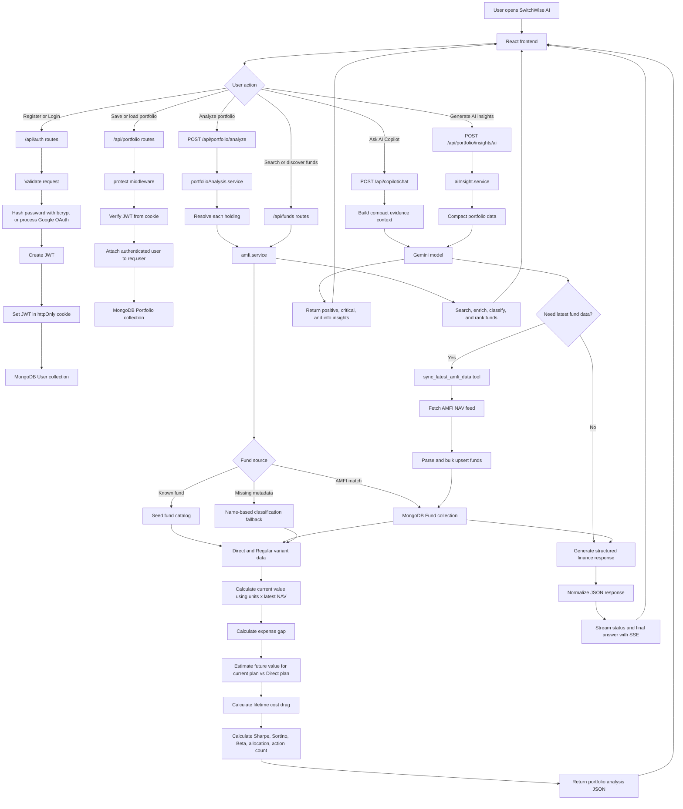

# SwitchWise AI

## Built For Retail Investors

SwitchWise AI is built for everyday retail investors who want to make better mutual fund decisions but do not have the time, background, or confidence to study markets in depth. The product focuses on simplifying fund selection, portfolio review, and cost comparison so that users can understand what they own, where they may be losing money, and what actions are worth considering without needing to read long factsheets or manually compare multiple schemes.

## Problem And Solution

Many investors stay away from mutual funds or make poor choices because the market feels complicated, risky, and time-consuming. They may not understand the difference between Direct and Regular plans, how expense ratios affect long-term returns, or whether a fund matches their goal and risk profile. SwitchWise AI solves this by combining structured financial calculations with an AI-assisted explanation layer. The backend analyzes holdings, compares Regular and Direct fund variants, estimates long-term cost drag, reviews allocation, and then presents the results in plain language through portfolio insights and an AI copilot. The goal is not to replace financial advice, but to make the first level of decision-making clearer, faster, and less intimidating.

## Product Overview

SwitchWise AI is a full-stack web application with a React frontend and a Node.js/Express backend. The backend handles authentication, portfolio storage, mutual fund search, AMFI NAV data enrichment, fund recommendation logic, portfolio analysis, and AI-powered explanations. The system is designed as a modular monolith: it runs as one backend service for simplicity, but the code is separated into routes, middleware, database models, and service modules so each part has a clear responsibility.

## Core Features

- User registration, login, logout, and Google OAuth authentication.
- Secure JWT-based sessions using httpOnly cookies.
- Portfolio saving and syncing for authenticated users.
- Mutual fund search using catalog data and AMFI-enriched records.
- Direct vs Regular plan comparison.
- Expense-ratio impact and long-term cost-drag estimation.
- Portfolio allocation, risk, and action summary.
- AI-generated portfolio insights.
- Finance-focused AI copilot with structured responses and fallback logic.
- Optional AMFI data ingestion for latest NAV records.

## Tech Stack

- Frontend: React, Vite, Axios, Lucide React.
- Backend: Node.js, Express.js, Mongoose.
- Database: MongoDB.
- Authentication: JWT, bcryptjs, Passport Google OAuth.
- AI: Google Gemini API.
- Data: AMFI NAV feed and prototype fund metadata.

## Project Structure

```txt
SwitchWise AI/
  backend/
    src/
      config/          Passport and OAuth configuration
      data/            Seed fund catalog
      middleware/      Authentication middleware
      models/          Mongoose schemas
      routes/          API route handlers
      scripts/         Data ingestion scripts
      services/        Business logic and AI services
      server.js        Express app entrypoint
  frontend/
    src/               React application
  package.json         Root scripts for install, dev, and checks
```

## Install And Run From GitHub

Follow these steps after cloning the repository on a new machine.

### 1. Prerequisites

Install the following before running the project:

- Node.js 18 or higher.
- Git.
- MongoDB running locally, or a MongoDB Atlas connection string.

### 2. Clone The Repository

```bash
git clone <your-github-repository-url>
cd "SwitchWise AI"
```

### 3. Install Dependencies

From the project root, install both backend and frontend dependencies:

```bash
npm run install:all
```

If you prefer installing manually:

```bash
cd backend
npm install
cd ../frontend
npm install
```

### 4. Configure Backend Environment

Create a `.env` file inside the `backend` folder:

```bash
cd backend
copy .env.template .env
```

On macOS or Linux, use:

```bash
cp .env.template .env
```

Update the values in `backend/.env`:

```env
PORT=4000
MONGODB_URI=mongodb://localhost:27017/switchwise
JWT_SECRET=your_long_random_secret
GOOGLE_CLIENT_ID=your_google_client_id
GOOGLE_CLIENT_SECRET=your_google_client_secret
CLIENT_ORIGIN=http://localhost:5173
BACKEND_URL=http://localhost:4000
NODE_ENV=development
```

Google OAuth is optional for local testing. Email/password login works as long as MongoDB and `JWT_SECRET` are configured.

### 5. Run The Application

From the project root:

```bash
npm run dev
```

This starts both servers:

- Backend API: `http://localhost:4000`
- Frontend app: `http://localhost:5173`

### 6. Optional: Ingest AMFI Fund Data

If the database is empty and you want real NAV data, run the AMFI ingestion script from the backend folder:

```bash
cd backend
node src/scripts/ingestAmfi.js
```

After this, fund search and portfolio calculations can use AMFI-enriched NAV data where available.

### 7. Health Check

Open this endpoint to verify that the backend is running:

```txt
http://localhost:4000/api/health
```

## Data Flow

The flow below shows how user actions move through the application, how the backend separates responsibilities, and where external data or AI services are used.



## Backend Approach

The backend was built as a modular monolith because it is the right fit for a hackathon product: quick to develop, easy to run locally, and simple to explain or deploy. A microservice setup was considered, but it would have added unnecessary complexity around service discovery, inter-service communication, deployment, and monitoring before the product had enough scale to justify it. Instead, the backend keeps strong internal boundaries: routes handle HTTP, middleware handles authentication, models define database structure, and services contain business logic.

## Why Deterministic Calculations Come Before AI

The financial calculations are handled in code instead of being left to the AI model. This was intentional. Calculations like expense-ratio impact, future value, current portfolio value, Sharpe ratio, Sortino ratio, beta, and allocation should be predictable and auditable. AI is used after that to explain the results in a more human way. This gives the product a stronger foundation because the numbers come from deterministic backend logic, while the AI improves usability and understanding.

## Alternatives Considered And Rejected

One option was to make the AI model responsible for most of the portfolio analysis, but that was rejected because financial outputs need consistency and traceability. Another option was to build separate services for auth, portfolio, fund data, and AI, but that would have slowed development and made local setup harder for a hackathon demo. A fully static fund catalog was also considered, but it would not be flexible enough for real fund search, so the backend combines prototype metadata with AMFI-enriched data and fallback classification.

## Security And Reliability Choices

Authentication uses JWT stored in httpOnly cookies so the token is not directly exposed to frontend JavaScript. Passwords are hashed with bcrypt before storage. Protected APIs use middleware to verify the JWT and load the user before allowing access. The AI services include fallback responses and rate-limit handling so the product can still provide useful output even when the model is unavailable, overloaded, or temporarily rate limited.

## What Comes Next

If there was another month to work on SwitchWise AI, the first priority would be a stronger production-grade fund data pipeline. That means scheduled AMFI sync, historical NAV ingestion, official factsheet ingestion, rolling returns, drawdown, alpha, benchmark comparison, and cleaner mapping between fund variants. This comes first because the quality of recommendations depends directly on the quality and freshness of the financial data.

## Next Product Improvements

After improving the data pipeline, the next focus would be deeper personalization: risk profiling, goal-based portfolio suggestions, tax and exit-load awareness, SIP planning, and alerts when a fund becomes expensive or drifts from the user's goal. The AI copilot could then become more context-aware, helping users compare actions instead of only reading analysis. Finally, the platform could add broker/CAS import support so users do not have to manually enter holdings.

## Troubleshooting

- If the frontend cannot call the backend, check that `CLIENT_ORIGIN` in `backend/.env` matches the frontend URL.
- If login fails, confirm that MongoDB is running and `JWT_SECRET` is set.
- If fund NAV values are missing, run the AMFI ingestion script.
- If AI features do not respond, check that `GEMINI_API_KEY` or `GOOGLE_API_KEY` is configured in `backend/.env`.
- If Google login fails, verify `GOOGLE_CLIENT_ID`, `GOOGLE_CLIENT_SECRET`, and `BACKEND_URL`.
